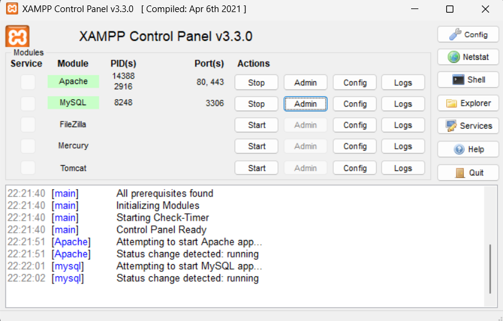
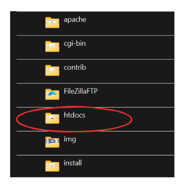
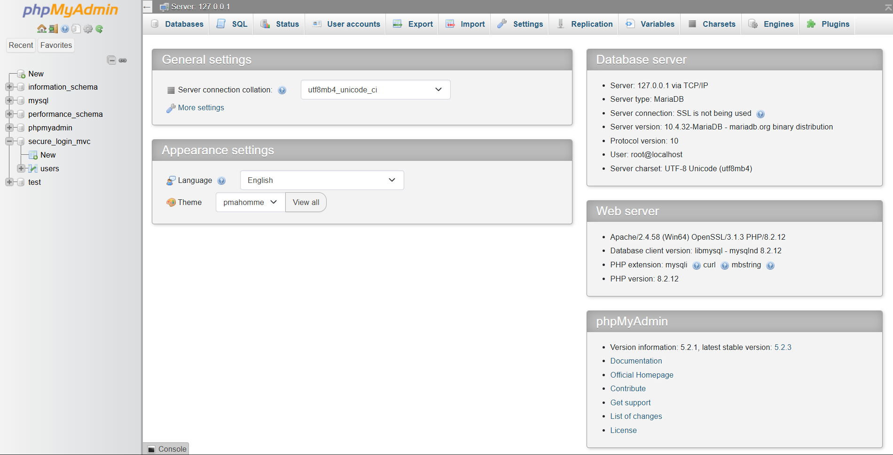
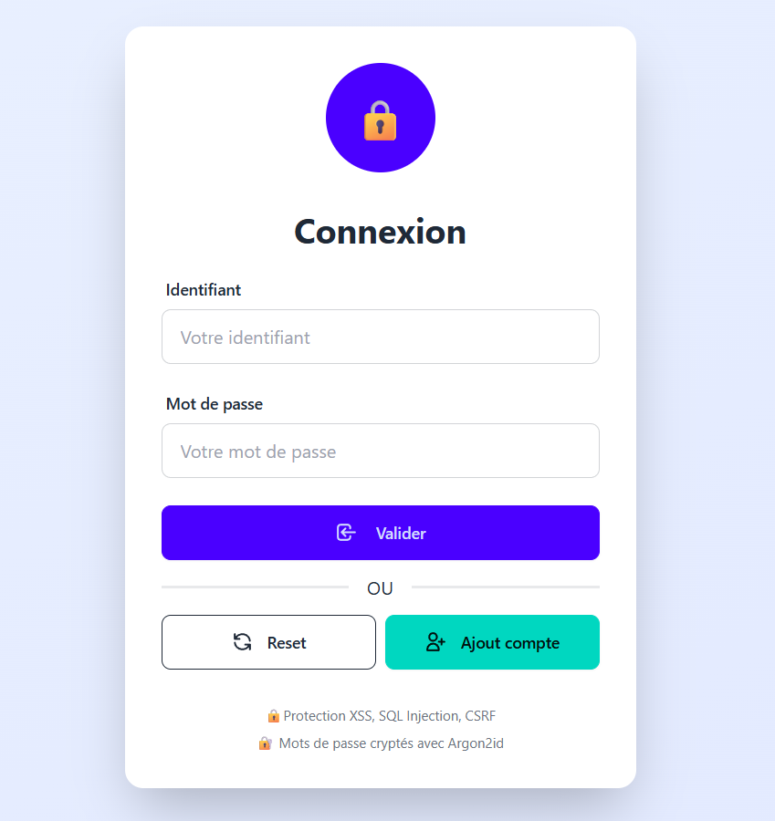
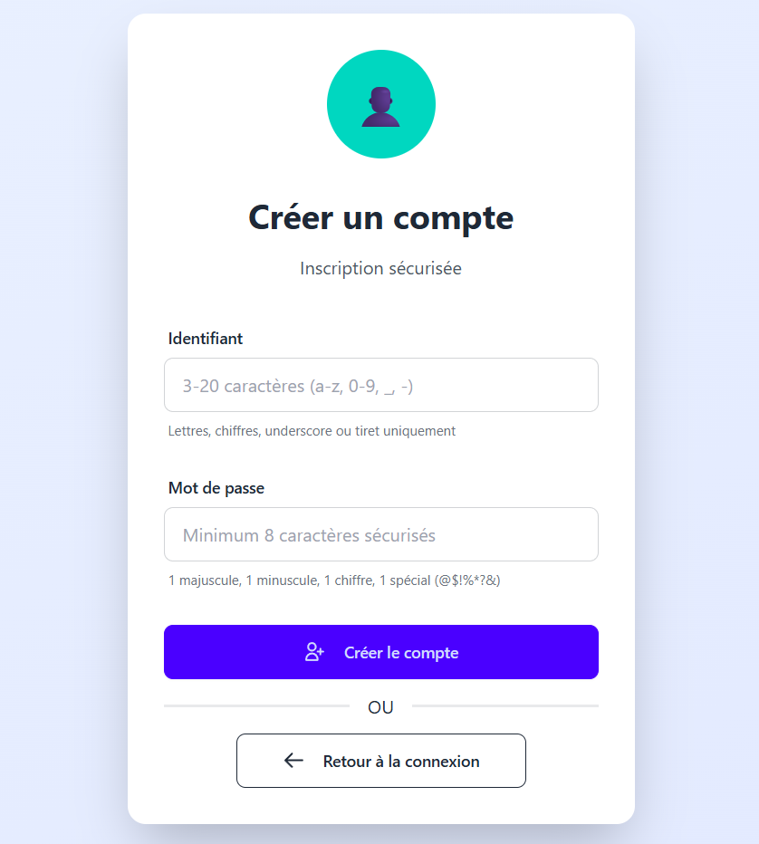
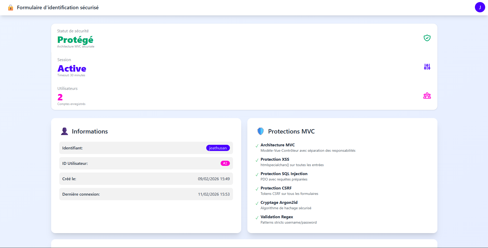
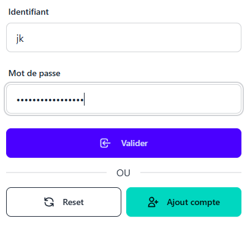
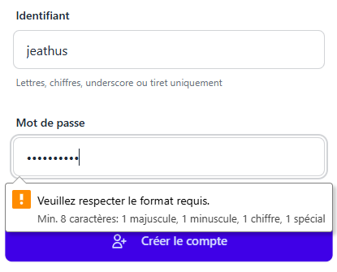
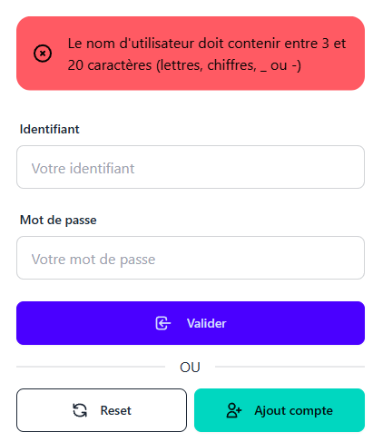
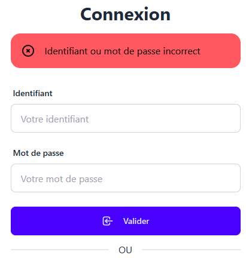

<div align="center">

# Formulaire d'Identification Sécurisé

</div>

<p align="center">
Projet académique réalisé dans le cadre du module <strong>Théorie de l'Information et Sécurité des Systèmes</strong>
</p>

<div align="center">


</div>

---

## À propos

Ce projet est une application web développée en **PHP natif** suivant strictement l'architecture **MVC (Modèle-Vue-Contrôleur)**. Il implémente un système d'authentification robuste et sécurisé, conçu pour être facilement évalué et déployé sur un environnement **XAMPP**.

<br>
<br>

## **_Fonctionnalités_**

| Fonctionnalité           | Détails                                                                               |
| ------------------------ | ------------------------------------------------------------------------------------- |
| **Structure MVC**        | Séparation claire : `Models` (Données), `Views` (Interface), `Controllers` (Logique). |
| **Routeur Personnalisé** | Gestion dynamique des URL via `index.php` et `.htaccess`.                             |
| **Singleton DB**         | Connexion unique et optimisée à la base de données.                                   |

<br>

## **_Sécurité_**

| Mesure                   | Description                                                       |
| ------------------------ | ----------------------------------------------------------------- |
| **Protection SQLi**      | Utilisation systématique de requêtes préparées via PDO.           |
| **Sécurité XSS**         | Échappement des sorties (Output Escaping).                        |
| **Hachage MDP**          | Utilisation de `password_hash()` (Argon2) pour les mots de passe. |
| **Protection Session**   | Configuration sécurisée des cookies de session.                   |
| **Protection CSRF**      | Implémentation de jetons anti-CSRF (tokens) dans les formulaires. |
| **Utilisation du Regex** | Validation et filtrage des données utilisateur via regex          |
| **Contrôle d'Accès**     | Images sécurisées, Dossiers verrouillés, Déconnexion propre       |
| **Cryptographie et Session** | Cookies durcis, Anti-Hijacking                                    |
| **Intégrité**            | Validation CDN                                                    |
| **Protection Anti-Bot**  | Honeypot                                                          |

<br>

## **_Détail de sécurité appliqué_**

- **SQL Injection** : Toutes les interactions avec la base de données utilisent des requêtes préparées via PDO, empêchant l'injection de code malveillant. Les requetest préparées séparent les données des commandes SQL, rendant impossible l'exécution de code non autorisé. Qui sont situées dans le fichier `app/models/User.php`.

- **Cross-Site Scripting (XSS)** : Toutes les données affichées dans les vues sont échappées à l'aide de `htmlspecialchars()`, empêchant l'exécution de scripts malveillants injectés par les utilisateurs. Cette mesure est appliquée dans tous les fichiers de la vue (`app/views/`).

- **Hachage des Mots de Passe** : Les mots de passe sont hachés à l'aide de `password_hash()` avec l'algorithme Argon2, assurant une protection robuste contre les attaques par force brute. Cette fonctionnalité est implémentée dans le contrôleur d'authentification (`app/controllers/AuthController.php`).

- **Protection des Sessions** : Les cookies de session sont configurés avec les flags `HttpOnly` et `Secure` pour empêcher l'accès via JavaScript et assurer la transmission sécurisée. Cette configuration est définie dans le fichier `config/config.php`.

- **Protection CSRF** : Un système de jetons anti-CSRF est implémenté pour tous les formulaires, garantissant que les requêtes proviennent de sources légitimes. Les jetons sont générés et vérifiés dans le contrôleur d'authentification (`app/controllers/AuthController.php`).

- **Validation des Données** : Les données utilisateur sont validées et filtrées à l'aide de expressions régulières (`regex`) pour assurer qu'elles respectent les formats attendus, réduisant ainsi les risques d'injection et de données malformées. Cette validation est également gérée dans le contrôleur d'authentification (`app/controllers/AuthController.php`).

- **Contrôle d'Accès (A1)** : 
* Images sécurisées : Les images sont désormais protégées contre l'accès direct et servies via un script PHP qui vérifie l'identité.
* Dossiers verrouillés : L'accès aux dossiers sensibles (`app, core, config`) est bloqué via .htaccess
* Déconnexion propre : Suppression totale des cookies côté client lors de la déconnexion.

- **Cryptographie et Session (A2)** :
* Cookies durcis : Activation des protections HttpOnly, SameSite=Strict et du mode strict pour empêcher les vols de session.
* Anti-Hijacking : Mise en place d'une "empreinte" (Fingerprint) qui vérifie que l'IP et le navigateur ne changent pas durant la session.

- **Intégrité (A8)** :
* Validation CDN : Sécurisation du chargement des bibliothèques externes (DaisyUI) pour garantir que le code n'est pas corrompu.

- **Protection Anti-Bot (Honeypot)** :
* Ajout de champs "pièges" invisibles dans les formulaires pour détecter et bloquer automatiquement les robots malveillants.


<br>
<br>

## **_Guide d'Installation_**

Suivez ces étapes pour configurer l'environnement de correction.

### 1. Prérequis

- **XAMPP** installé : https://www.apachefriends.org/fr/index.html

- Modules **Apache** et **MySQL** démarrés (status : vert).

<br>



<br>

### 2. Installation des fichiers

1. Clonez ce dépôt ou copiez le dossier dans le répertoire `htdocs` de XAMPP.



2. Le chemin final doit ressembler à :
   `C:\xampp\htdocs\formulaire_php_mvc`

<br>

### 3. Configuration de la Base de Données

1. Accédez à **PHPMyAdmin** : [http://localhost/phpmyadmin](http://localhost/phpmyadmin)

<br>



2. Créez une nouvelle base de données (`Nom : secure_login_mvc`).
3. Cliquez sur l'onglet **Importer**.
4. Sélectionnez le fichier **`database.sql`** situé à la racine du projet (`C:\xampp\htdocs\formulaire_php_mvc\database.sql`).
5. Cliquez sur **Exécuter**.

> **Note :** Le script SQL crée automatiquement la base de données nommée `secure_login_mvc` et la table `users`.

<br>

### 4. Vérification de la Configuration

Le fichier `config/config.php` est pré-configuré pour XAMPP par défaut :

| Paramètre   | Valeur             |
| ----------- | ------------------ |
| **DB_HOST** | `localhost`        |
| **DB_NAME** | `secure_login_mvc` |
| **DB_USER** | `root`             |
| **DB_PASS** | `''` (vide)        |

<br>

## Test

Une fois l'installation terminée :

1. Ouvrez votre navigateur.
2. Accédez à l'URL du projet :
   [http://localhost/formulaire_php_mvc/](http://localhost/formulaire_php_mvc/)
3. Vous devriez voir la page d'accueil avec les options de connexion et d'inscription.    
Vous douvez Cliquer sur "`Ajoute compte`" pour créer un compte, puis `vous connecter avec les identifiants créés`.

<br>



   <br>



<br>
<br>



<br>
<br>

#### __*Gestion des erreurs*__

* `Inscription` : erreur si l'identifiant a moins de 3 caractères et le mot de passe moins de 8 caractères, avec les conditions à respecter.

* `Connexion` : erreur si les identifiants sont incorrects ou si les champs sont vides.

<br>

<table>
  <tr>
    <td align="center" width="50%">
      
    </td>
    <td align="center" width="50%">
       
    </td>
  </tr>

  <tr>
    <td align="center" width="50%">
       
    </td>
    <td align="center" width="50%">
       
    </td>
  </tr>
</table>


<br>
<hr>

### Comptes de test

Vous pouvez créer un compte via le formulaire d'inscription ("S'inscrire") et vérifier la base de données après création.

<br>
<br>

## Structure des Dossiers

Une vue d'ensemble pour naviguer dans le code lors de la correction :

```bash
formulaire_php_mvc/
├── app/
│   ├── controllers/    # AuthController.php (Gestion connexion/inscription)
│   ├── models/         # User.php (Interactions BDD)
│   └── views/          # Fichiers .php (Templates HTML)
├── assets/
│   └── css/            # Style.css
├── config/
│   └── config.php      # Constantes (DB, Roots, URL)
├── core/
│   ├── App.php         # Routeur (Parse l'URL)
│   ├── Controller.php  # Classe Mère des contrôleurs
│   └── Database.php    # Connexion BDD (Pattern Singleton)
├── database.sql        # Script d'initialisation SQL
├── index.php           # Front Controller (Point d'entrée unique)
└── README.md           # Documentation
```

---

<div align="center">
    <i>Projet réalisé par Jeathusan KUGATHAS - étudiant Master informatique et big data à Paris8.</i>
</div>
